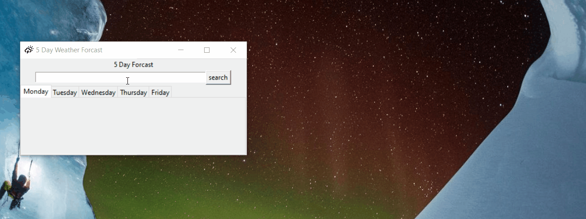

# Weather Forecast App

## About

This app uses data from the Met Office to create a 5 day weather forecast for any
UK location. The reason I chose to create this project was to increase my
familiarity with using APIs and creating a GUI using the Tkinter Python Library.

## Technologies used

- Python 3.8
- Tkinter

## Results

